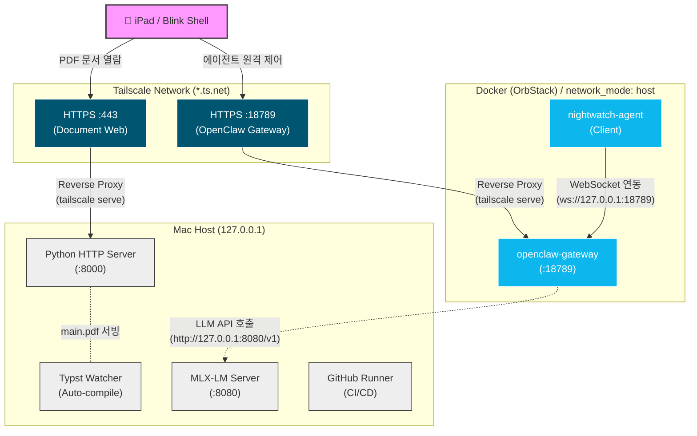

# 🕸️ NightWatch & OpenClaw Network Architecture

이 문서는 iPad와 Blink Shell 환경에서 로컬(Mac)의 자원을 활용하기 위한 네트워크 아키텍처를 설명합니다. `Tailscale`, `Docker`, 그리고 `Local Process` 간의 복잡한 포트 포워딩 및 통신 구조를 시각화하여 디버깅 및 시스템 이해를 돕습니다.

---

## 1. 네트워크 다이어그램 (Network Topology)

아래 다이어그램은 모바일 기기(iPad)에서 Tailscale VPN을 통해 Mac 호스트의 서비스와 Docker 내부 에이전트로 트래픽이 어떻게 라우팅되는지 보여줍니다.

---

## 2. 포트 및 엔드포인트 매핑 가이드

시스템을 구성하는 핵심 프로세스들이 점유하는 포트와 그 용도는 다음과 같습니다.

### 2.1. 로컬 서비스 포트 맵
| 서비스명 | Host Port | Tailscale 노출 | 설명 |
|---|---|---|---|
| **Python HTTP Server** | `127.0.0.1:8000` | `HTTPS:443` | `Typst_project/main.pdf` 등 컴파일된 결과물을 iPad 브라우저에 서빙합니다. |
| **OpenClaw Gateway** | `127.0.0.1:18789` | `HTTPS:18789` | 에이전트와 외부 디바이스 간의 통신 중계를 담당하는 핵심 허브입니다. |
| **MLX-LM Server** | `127.0.0.1:8080` | (노출 없음) | 로컬 `Qwen2.5-Coder` 모델 서빙을 담당합니다. 호스트 전용입니다. |
| **nightwatch-agent** | (동적) | (노출 없음) | 게이트웨이에 WebSocket(`ws://127.0.0.1:18789`)으로 연결되는 클라이언트입니다. |

### 2.2. Tailscale (`tailscale serve`) 원격 접속 URL 부여
Blink Shell, iPad 등 Tailnet에 연결된 다른 기기들이 로컬 Mac의 서비스에 안전하게 접근할 수 있도록 `tailscale serve` 명령어를 사용하여 역방향 프록시(Reverse Proxy)를 구성합니다.

- **문서 뷰어 (HTTP Server)**: 
  - 로컬 `127.0.0.1:8000` 트래픽을 Tailnet의 `HTTPS:443` 포트로 포워딩합니다.
  - **접속 URL**: `https://<Tailnet_Domain>/Typst_project/main.pdf`
- **OpenClaw Gateway**: 
  - 로컬 `127.0.0.1:18789` 트래픽을 Tailnet의 `HTTPS:18789` 포트로 포워딩합니다.
  - **접속 URL**: `https://<Tailnet_Domain>:18789`

> **참고**: `tailscale serve --yes --bg --https=...` 명령은 `start_workspace.sh` 스크립트 실행 시 자동으로 백그라운드에서 가동되며, 고유한 Tailnet 도메인에 기반하여 엔드포인트 URL을 구성합니다.

---

## 3. 핵심 디버깅 체크리스트

네트워크 문제 발생 시, 다음 순서대로 문제의 원인을 좁혀나가세요.

### 🔴 3.1. 에이전트(OpenClaw) 통신 실패
- **구조적 특징:** `openclaw-gateway`와 `nightwatch-agent`는 `docker-compose.yml`에서 `network_mode: host`로 실행됩니다. 즉, 별도의 포트 매핑(`-p 18789:18789`) 없이 Mac의 `127.0.0.1` 공간을 직접 공유합니다.
- **체크포인트:** 호스트에서 `lsof -i :18789` 명령어로 게이트웨이 포트가 정상 바인딩되었는지 확인하세요.

### 🔴 3.2. iPad 모바일 접속 불가
- **구조적 특징:** Tailscale의 `serve` 기능을 이용해 127.0.0.1의 트래픽을 Tailnet으로 포워딩(Reverse Proxy) 합니다.
- **체크포인트:**
  - Mac 터미널에서 `tailscale serve status`를 실행하여 포워딩 상태(`443 -> 8000`, `18789 -> 18789`)가 살아있는지 점검합니다.
  - 외부 접근 URL 예시: 
    - 문서 열람: `https://<본인도메인>.ts.net/Typst_project/main.pdf`
    - 게이트웨이: `https://<본인도메인>.ts.net:18789`

### 🔴 3.3. 로컬 LLM (MLX) 타임아웃
- **구조적 특징:** 에이전트는 추론 시 로컬의 `127.0.0.1:8080/v1`으로 API 요청을 보냅니다.
- **체크포인트:** 
  - `start_workspace.sh` 기동 시 `8080` 포트 점유 해제가 실패했을 수 있습니다.
  - `curl http://127.0.0.1:8080/v1/models` 명령어를 쳐서 응답이 제대로 오는지 확인합니다.
