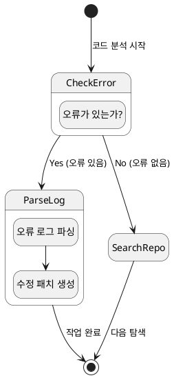

# NightWatch 핵심 로직 흐름도

```plantuml
@startuml
hide empty description

[*] --> CheckError : 코드 분석 시작

state CheckError {
  state "오류가 있는가?" as HasError
}

CheckError --> ParseLog : Yes (오류 있음)
CheckError --> SearchRepo : No (오류 없음)

state ParseLog {
  state "오류 로그 파싱" as Parsing
  state "수정 패치 생성" as Patching
  Parsing --> Patching
}

ParseLog --> [*] : 작업 완료
SearchRepo --> [*] : 다음 탐색
@enduml
```
